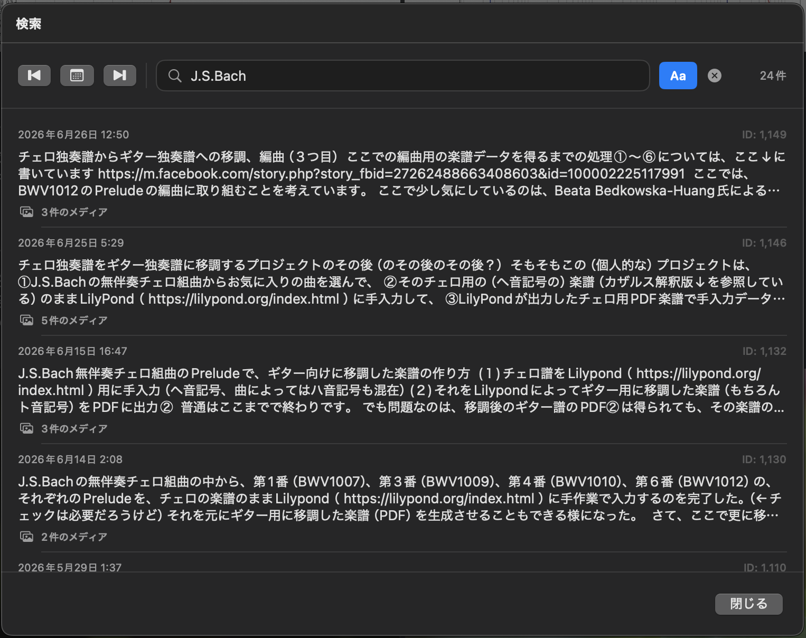
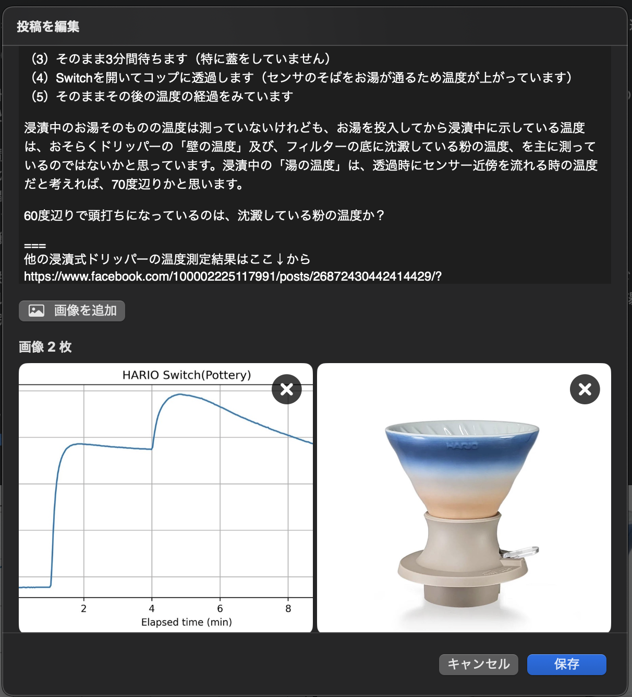

# myDiary

A **local-first** diary application for macOS built with **SwiftUI**, **GRDB**, and **SQLite**.

myDiary stores your diary entirely on your own Mac. Unlike cloud-based diary services or social networks, your memories remain under your control and can be exported as an open **Diary Package**.


| Timeline | Image Viewer |
|-----------|--------------|
|  |  |

| Search | Editor |
|--------|--------|
|  |  |

---

# Why myDiary?

Many diary applications depend on proprietary cloud services.

myDiary is different.

- Local-first
- Offline by default
- Portable
- Searchable
- Independent of any online platform

Everything—including posts, comments, images, and relationships—is stored locally and can be transferred to another computer using a Diary Package.

---

# Features

## 📝 Diary

- Create, edit and delete posts
- Rich text editor
- Multiple images per post
- Parent / child comments
- Unlimited nested replies
- Related posts
- Reply to any post
- Edit existing posts

---

## 🖼 Images

- Automatic thumbnail generation
- Display image / Original image switch
- Full-screen image viewer
- Delete images
- Reorder images
- Open original image
- Link preview image support
- YouTube thumbnail support
- Cached preview images

---

## 💬 Threaded Comments

Unlimited nesting.

```text
Post
    Comment
        Reply
            Reply
                ...
```

Features include

- Automatic indentation
- Recursive rendering
- Reply navigation

---

## 🔗 Related Posts

Create links between related diary entries.

Useful for

- Continuation articles
- Revisions
- Reference material
- Project notes

Links can be

- Created
- Deleted
- Reordered

Backlinks are generated automatically.

---

## 🔍 Search

Search by

- Body text
- Comments
- Replies
- Date
- Database ID

Selecting a result

- Opens the matching post
- Scrolls to the exact comment
- Preserves navigation history

---

## 📦 Diary Package

Export the complete diary as a portable package.

Includes

- Posts
- Comments
- Images
- Image metadata
- Related-post links

The package can later be imported into another myDiary database.

---

## 🌍 Localization

myDiary currently supports

- 🇺🇸 English
- 🇯🇵 Japanese

The user interface automatically follows the macOS language settings.

---

# Architecture

```text
SwiftUI
      │
      ▼
TimelineViewModel
      │
      ▼
PostRepository
      │
      ▼
GRDB
      │
      ▼
SQLite
```

Images are managed independently from the database.

---

# Technologies

- SwiftUI
- Observation
- GRDB
- SQLite
- UniformTypeIdentifiers

---

# Roadmap

## Version 1.0

- ✅ Timeline
- ✅ Threaded comments
- ✅ Related posts
- ✅ Image management
- ✅ Image viewer
- ✅ Link preview cache
- ✅ Search
- ✅ Diary Package Import
- ✅ Diary Package Export
- ✅ About window
- ✅ English localization

### Planned

- TeX export
- PDF export
- iCloud synchronization
- iPad version
- iPhone version
- StoreKit support

---

# Philosophy

myDiary is **not** another social networking application.

Its purpose is to preserve personal memories for decades.

Your diary should remain

- Yours
- Portable
- Searchable
- Independent of any online service

---

# License

MIT License
